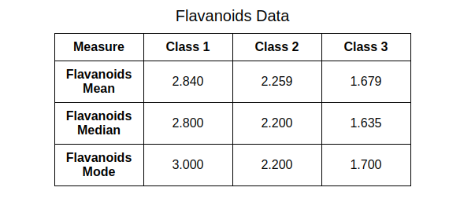
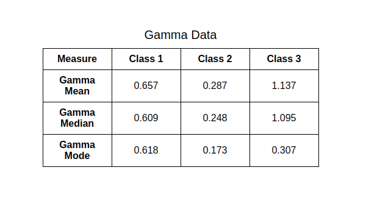

# Steps to run project:-

Take a clone of a project, using command:-

### `git clone <repo_link>`

then you need to navigate to project directory using the terminal or command prompt and then run the following command:

### `yarn install`

After that, you can run:

### `yarn start`

Open [http://localhost:3000](http://localhost:3000) to view it in your browser.

Here are the screenshots of the table of the project.

